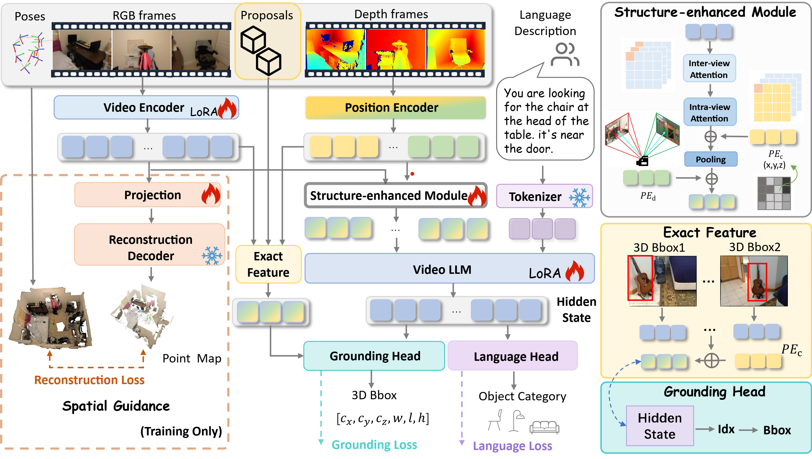

<div align="center">

# [CVPR'26] S^2-MLLM: Boosting Spatial Reasoning Capability of MLLMs for 3D Visual Grounding with Structural Guidance
[Beining Xu*, Siting Zhu*, Zhao Jin, Junxian Li, Hesheng Wang^]

</div>


<div align="center">
  <h2 align="center">
  <a href="https://github.com/IRMVLab/S2-MLLM.git" target='_blank' style="text-decoration: none;"></a>
  <a href="https://arxiv.org/abs/2512.01223" style="display: inline-block; text-align: center;">
      
  </a>
</div>


#### News

- **2026-03-23:** This repo is released.  
- **2026-02-21:** S$^2$-MLLM is accepted by CVPR 2026.


---

> **Abstract:** 3D Visual Grounding (3DVG) focuses on locating objects in 3D scenes based on natural language descriptions, serving as a fundamental task for embodied AI and robotics. Recent advances in Multi-modal Large Language Models (MLLMs) have motivated research into extending them to 3DVG.However, MLLMs primarily process 2D visual inputs and struggle with understanding 3D spatial structure of scenes solely from these limited perspectives. Existing methods mainly utilize viewpoint-dependent rendering of reconstructed point clouds to provide explicit structural guidance for MLLMs in 3DVG tasks, leading to inefficiency and limited spatial reasoning. To address this issue, we propose S$^2$-MLLM, an efficient framework that enhances spatial reasoning in MLLMs through implicit spatial reasoning. We introduce a spatial guidance strategy that leverages the structure awareness of feed-forward 3D reconstruction. By acquiring 3D structural understanding during training, our model can implicitly reason about 3D scenes without relying on inefficient point cloud reconstruction. Moreover, we propose a structure-enhanced module (SE), which first employs intra-view and inter-view attention mechanisms to capture dependencies within views and correspondences across views. The module further integrates multi-level position encoding to associate visual representations with spatial positions and viewpoint information, enabling more accurate structural understanding. Extensive experiments demonstrate that S$^2$-MLLM unifies superior performance, generalization, and efficiency, achieving significant performance over existing methods across the ScanRefer, Nr3D, and Sr3D datasets.

---

### Pipeline



---
### Installation
1. Clone this repository:
```bash
git clone https://github.com/IRMVLab/S2-MLLM.git
```

2. Create the conda environment:
```bash
conda create -n s2mllm python=3.10 -y
conda activate s2mllm
pip install --upgrade pip  
pip install -r requirements.txt
pip install flash-attn --no-build-isolation     
```
---
### Data Process
1. Download Scanrefer, Nr3D, Sr3D

2. Download the ScanNetv2 dataset, EmbodiedScan dataset 

3. Exact meta information

3. Convert the annotation
---

### Train
```bash
bash scripts/3d/train/train.sh
```
---

### Evaluation
```bash
bash scripts/3d/eval/eval_scanrefer.sh
```
---
### Citation
```ruby
@article{xu2025s,
  title={S $\^{} 2$-MLLM: Boosting Spatial Reasoning Capability of MLLMs for 3D Visual Grounding with Structural Guidance},
  author={Xu, Beining and Zhu, Siting and Jin, Zhao and Li, Junxian and Wang, Hesheng},
  journal={arXiv preprint arXiv:2512.01223},
  year={2025}

}
```